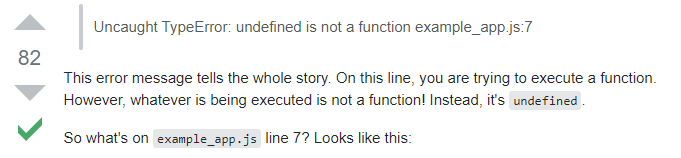

# Guía para enfrentarse a problemas técnicos de manera autónoma

En nuestro día a día las programadoras nos enfrentamos a problemas que, muchas veces, nos resulta difícil solucionar solas.

Para Adalab y para los profes es importante que sepas:

- **A programar se aprende programando**, probando cosas, **rompiendo cosas** que ya funcionan para ver qué pasa, **solucionando errores**...
- Saber solucionar errores es más importante que saber hacer un código bien a la primera. **Nadie consigue hacer un código bien a la primera.** Sería como pintar un cuadro sin fallar ni una sola pincelada.
- Los errores no se pueden enseñar. **A solucionar errores se aprende solucionándolos.**
- **Al solucionar un error aprendemos muchísimo** sobre cómo funciona la programación.
- **Todos las dudas, problemas y errores que tengas ya los ha tenido alguien antes.** Y lo más probable es que esa persona haya preguntado en un foro, escrito un artículo o subido la solución a un repo...
- La programación evoluciona muy rápido, debemos saber buscar recursos para solucionar errores y estar al día.
- Durante toda tu vida como programadora te enfrentarás a muchísimos errores.
- **Todo programador**, por muy senior que sea, **siempre es junior en algo**.
- Las profesoras te ayudaremos mucho durante el curso, pero después tendrás que ser autónoma.
- Si las profes tuvieramos que elegir una sola cosa que enseñarte bien, sería a **ser autónoma, autididacta y saber buscar tus propios recursos para seguir aprendiendo**.

Afortunadamente existen montones de recursos en los que apoyarnos. Os recomendamos:

## Páginas famosas con recusos técnicos

- Resolución de dudas y búsqueda de errores: [Stack Overflow](https://stackoverflow.com).
- Artículos y tutoriales sobre HTML y CSS: [CssTricks](https://css-tricks.com/).
- Documentación sobre muchos lenguajes de programación: [Devdocs](https://devdocs.io/).

## Documentación oficial

Una buena idea es consultar la documentación oficial de los lenguajes y herramientas que estés usando:

- [Documentación oficial para HTML, CSS y JavaScript en MDN](https://developer.mozilla.org/es/)
- [Documentación oficial de React](https://es.reactjs.org/)

Puede ocurrir que la documentación no cubra nuestra duda o que el lenguaje que use aún nos resulte demasiado técnico, en cuyo caso es momento de buscar en Google.

## Búsqueda en Google

Buscar en Google nuestro problema es muy buena opción y aunque no hace falta redactar la pregunta como la haría William (Shakespeare) sí que usar el inglés nos va a dar una ventaja significativa.

Vamos a ver algunos ejemplos, cuando buscamos información y cuando buscamos un error concreto:

### Buscar información

- Nos suena que el método `split()` nos va a solucionar la vida pero no sabemos o no nos acordamos cómo usarlo, ni dónde estará la documentación:
  - [js split](https://www.google.com/search?hl=en&q=js%20split)
- Estamos a tope con un tema de radio buttons pero no nos aclaramos a comprobar cuándo un radio button está marcado:
  - [js check if a radio button is checked](https://www.google.com/search?q=js+check+if+a+radio+button+is+checked&oq=js+check+if+a+radio+button+is+checked&aqs=chrome..69i57j0i22i30l7.388j0j7&sourceid=chrome&ie=UTF-8)
- ¡Espera! esta búsqueda no me sirve porque todos los resultados hablan de JQuery
Pues nada, sin JQuery:
  - [js check if a radio button is checked -jquery](https://www.google.com/search?q=js+check+if+a+radio+button+is+checked+-jquery&oq=js+check+if+a+radio+button+is+checked+-jquery&aqs=chrome..69i57j69i64.751j0j9&sourceid=chrome&ie=UTF-8)

### Buscar un error concreto

A veces nos van a saltar errores que podríamos no entender. Una opción es copiar el error, meterlo entre comillas, añadir el lenguaje de programación para ayudar a Google a acotar las respuestas y buscar a ver qué sale.

- En este ejemplo hemos intentado reasignar una constante y en la consola nos aparece el error `Assignment to constant variable`. Vamos a suponer que no entendemos que pasa y nos vamos a nuestro buscador favorito a buscar:
   - [javascript "Assignment to constant variable"](https://www.google.com/search?ei=4cfIX4-_JY6cgQawq7PgCA&q=javascript+%22Assignment+to+constant+variable%22+&oq=javascript+%22Assignment+to+constant+variable%22+&gs_lcp=CgZwc3ktYWIQAzIGCAAQBxAeMgYIABAHEB46BAgAEEc6AggAOgYIABAWEB5Q7iZYwTJgsDRoAHADeACAAXCIAbUCkgEDMS4ymAEAoAEBoAECqgEHZ3dzLXdpesgBAsABAQ&sclient=psy-ab&ved=0ahUKEwjPs8nf1rHtAhUOTsAKHbDVDIwQ4dUDCA0&uact=5)

### En inglés

Siempre es mejor buscar en inglés, intenta no complicarte con sentencias muy elaboradas. Usa palabras claves sencillas y lo más probable es que Google te sugiera autocompletar la búsqueda en base a lo que han buscado otras personas.

### Resultados

Una vez hecha la búsqueda lo mejor es comenzar con los resultados de páginas que ya conocemos y en las que confiamos como **Stack Overflow** o **Css-tricks**. Si no aparece ninguna de estas, pues como en cualquier búsqueda empezamos con el primer resultado ;)

## Stack Overflow

Puede que entre los resultados de Google aparezca [Stack Overflow](https://stackoverflow.com).
**Es un foro muy, muy, muy útil para compartir conocimientos y resolver errores.** Es tan famosa que a veces, cuando una empresa va a contratar a un programador, mira su reputación en Stack Overflow.

Lo más probable es que alguien ya haya realizado la misma pregunta o una muy similar y que la comunidad le haya ayudado a resolverla. Veamos lo básico de Stack Overflow.

Supongamos que estamos programando y nos sale el error `undefined is not a function`. Lo buscamos en Google y como primer resultado nos sugiere [esta página de Stack Overflow](https://stackoverflow.com/questions/13502733/uncaught-typeerror-undefined-is-not-a-function-beginner-backbone-js-applica).

Ábrela y observa los números y flechas que hay a la izquierda de la pregunta y las respuestas.

1. A la izquierda de la pregunta tenemos un número, ese número indica los "me gusta" o votos de otros programadores. Puede ser muy alto si es una buena pregunta o incluso negativo si es una pregunta que no está bien redactada, o no tiene sentido.
1. A la izquierda de las respuestas también tenemos el número de "me gusta" o votos. La respuesta con más "me gusta" es la que más nos interesa.
1. Si una respuesta tiene un check verde significa que la persona que preguntó ha marcado esa respuesta como válida, ya que le ayudó a solucionar el problema.
1. Muchas veces una pregunta viene marcada como duplicada, con un enlace a otra pregunta muy similar.

## Comunidad

Cuando todo lo demás ha fallado, o hemos encontrado una solución pero no estamos del todo conformes con ella hay que recurrir a la comunidad más cercana, preguntando:

1. A compañeras de curso
1. En canales de Slack
1. A las profesoras.
