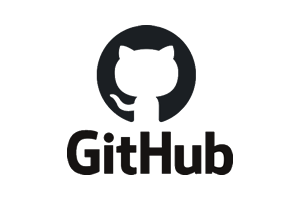
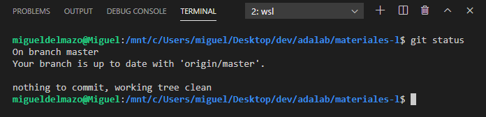
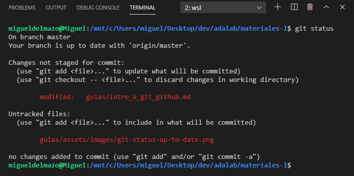

# Introducción a Git y GitHub

Con el objetivo de empezar a trabajar de manera óptima en remoto desde el primer día de curso vamos a aprender lo básico sobre Git y GitHub. En los primeros días de clase también os lo explicaremos en detalle.

## Qué es Git


[Git](https://git-scm.com/) es un sistema de **control de versiones** de código además de una **herramienta para compartir** código.

El control de versiones nos sirve para ver el histórico de cambios que hemos hecho en el código. Es útil pasar saber por ejemplo que hace un mes nuestra compañera Mari Carmen añadió un determinado código al proyecto. **Git nos dice quién, cuándo, por qué y dónde se cambió cada línea de código de un proyecto.**

También es una herramienta para compartir código entre nuestras compañeras de programación de los proyectos de Adalab, nuestros profes o la empresa en la que trabajaremos. **Es como el Drive o Dropbox de los programadores.**

## Qué es GitHub



Si Git es el sistema o programa para compartir código, [GitHub](https://github.com) es una de tantas empresas que hay para usar Git. A través de su web podemos crear proyectos y compartirlos con otras personas. También funciona como red social de programación.

Muchos de los servicios que ofrece GitHub (que por cierto ha sido recientemente comprada por MicroSoft) son gratuitos y otros son de pago.

## Cómo clonar un repositorio de otra persona

Vamos a empezar por clonar un repositorio de otra persona. En concreto vamos a clonar el repositorio donde las profes subimos los ejercicios hechos en clase. De esta forma, al acabar cada clase podrás descargarte el código de dichos ejercicios:



Los comandos utilizados en [este vídeo](https://www.youtube.com/watch?v=iPM_yuknDjM) son:

```bash
git clone https://github.com/adalab/ejercicios-en-clase-X
```

```bash
git pull
```

## Cómo crear mi repositorio de Git

A continuación te pedimos que crees tu propio repositorio en GitHub donde durante el curso irás subiendo los ejercicios que hagas en clase. Al subirlos a la nube podrás compartirlos con tus compañeras y ellas contigo. En programación lo compartimos todo!!!



Los comandos utilizados en [este vídeo](https://www.youtube.com/watch?v=UazjdwT9Xvg) son:

```bash
git add -A
```

```bash
git commit -m "Mensaje del commit"
```

```bash
git push
```

### Estructura de carpetas

Os recomendamos que vuestro repositorio de `ejercicios-de-adalab` cumpla con las siguientes características:

- Cada ejercicio que hagamos en una carpeta. **Nunca se deben hacer dos ejercicios en la misma carpeta**, da muchos errores. **Insistimos, nunca haremos dos ejercicios en la misma carpeta.**
- El nombre de la carpeta que sea `modulo-x-leccion-y-ejercicio-z-descripcion`. Por ejemplo:
  - `modulo-1-leccion-04-ejercicio-03-flexbox`
  - `modulo-1-leccion-12-ejercicio-10-grid`
- Si todas las alumnas seguís este patrón es muy fácil compartir ejercicios y códigos entre vosotras.

## Git status

Ya sabemos usar los comandos de Git `clone`, `add`, `commit`, `pull` y `push`. Solo nos queda por aprender un comando importante: `git status`.

`git status` nos dice el estado actual en el que está nuestro repo. Es muy útil para saber lo que tenemos que hacer, o porqué estamos teniendo un problema que no nos deja avanzar.

Supongamos que yo acabo de de subir mi código con un `git add -A`, `git commit -m "My message"` y `git push` al repositorio remoto. Es decir mi repo local y el remoto están igual. Si yo escribo el comando `git status` me aperecerá:



Es decir, `git status` me está diciendo que estoy actualizado.

A continuación decido modificar el fichero de mi repo `guias/intro_a_git_github.md` y añado un fichero nuevo que se llama `guias\assets\images\git-status-with-changes.png` y ejecuto el comando `git status`. En la terminal aparecerá algo como:



Es decir, me está diciendo que tengo un fichero modificado y un fichero que acabo de añadir. Además me sugiere varios comandos que puedo utilizar para añadir los cambios al repo o para deshacer los cambios.

Es importante que para acostumbrarte a utilizar Git y para asimilar bien cómo funciona internamente, cada vez que ejecutes un comando leas lo que responde la terminal. Y después de ejecutar un comando cualquiera ejecuta `git status` para ver en qué estado estás.

## Repositorios de Adalab

Durante el curso vamos a utilizar los siguientes repositorios de Git / GitHub. Te recomendamos que los clones en tu ordenador y hagas `git pull` frecuentemente.

- **https://github.com/adalab/ejercicios-en-clase-l:** repositorio donde las profesoras vamos a subir los ejercicios hechos en clase de esta promoción.
- **https://github.com/adalab/soluciones-alumnas-l:** repositorio para que alumnas subáis las soluciones de los ejercicios que queráis compartir con las compañeras. Os recomendamos que cuando terminéis un ejercicio lo subáis a este repositorio, las compañeras os lo agradecerán.
- **https://github.com/adalab/ejercicios-extra:** repositorio con enunciados y ejercicios extras resueltos, de todas las promociones.
- **https://github.com/adalab/adalab-web-starter-kit:** repositorio con el proyecto base que utilizaremos en el módulo 1 y 2.
- **https://github.com/adalab/recursos-de-las-alumnas:** recursos técnicos creados por las alumnas.