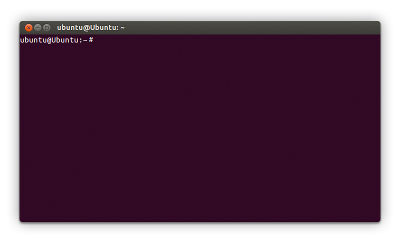
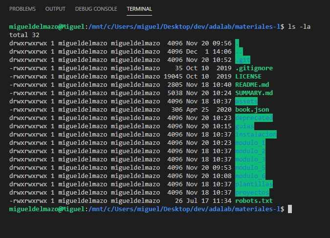

# Instalación de la terminal

## Qué es la terminal

La terminal, también conocida como consola o shell, es una de nuestras herramientas principales en el desarrollo. Nos permite comunicarnos con el sistema operativo mediante pequeñas instrucciones de texto, **llamadas comandos**, sin necesidad de una interfaz gráfica. Tiene esta pinta:



Hay diferentes tipos de terminales, nosotras utilizaremos la terminal **Bash**.

## Instalación de la terminal

### Instalación en Mac y Ubuntu

**Mac y Ubuntu ya vienen con una terminal bash instalada de serie.** Por ello no necesitamos instalar nada más. Si quieres abrir tu terminal busca en el menú de Ubuntu o Mac el programa **Terminal**.

### Instalación en Windows 10

Windows tiene sus propias terminales como MS-DOS y Power Shell. Estas terminales **no** nos valen para programar así que vamos a instalar un mini Ubuntu dentro de Windows. Para ello:

1. Desde el menú inicio de tu Windows busca y abre **Microsoft Store**.
1. En el buscador del store busca **Ubuntu**.
1. Instala **Ubuntu 18.04 LTS**.
1. Verás que en tu menú inicio se habrá añadido un programa llamado **Ubuntu 18.04 LTS**, ábrelo.
1. Te pedirá que añadas una nueva contraseña. **Esta contraseña es la que utilizaremos para instalar programas en la terminal.** No la pierdas!

Una vez terminado debes:

1. Desde el menú inicio de tu Windows busca y abre **Activar o desactivar las características de Windows**.
1. Activa la opción **Subsistema de Windows para Linux**. Acepta y reinicia.

Después de haber hecho estas dos cosas tu Windows contará con una **terminal** que funciona igual que si estuvieras trabajando en Linux / Ubuntu.

A continuación vamos a configurar **VS Code** para que siempre trabaje con esta terminal:

1. Abre la configuración de VS Code pulsando en el icono de la tuerca (esquina inferior izquierda)  y a continuación **Settings**.
1. Busca la opción **Terminal > External: Windows exec**.
1. Añade el texto **C:\windows\System32\cmd.exe**.
1. Abre una terminal puslando en el menú superior > **Terminal** > **New terminal**: una nueva terminal se abrirá en la parte inferior de VS Code.
1. En dicha parte inferior hay un desplegable, ábrelo y pulsa en **Select default shell**.
1. Selecciona la opción **WSL Bash**.

### Problemas al instalar la terminal en Windows 10

A veces desde Windows 10 abrimos una terminal en VS Code y esta aparece vacía, no aparece ningún texto.

Nos hemos dado cuenta que algunos antivirus bloquean la terminal. **Nuestra recomendación es desinstalar el antivirus y reiniciar el ordenador.** En el 99% de los casos se soluciona.

Si aún así, la terminal sigue sin funcionar, **te ayudaremos a que funcione** durante los primeros días de clase.

## Usar la terminal dentro de VS Code

En Mac, Windows y Ubuntu tenemos dos formas de utilizar la terminal:

- Buscándola en el menú del sistema operativo y abriéndola o
- Desde dentro de VS Code.

Preferimos hacerlo desde dentro de VS Code porque es más cómodo. Por ejemplo las opciones de copiar y pegar funcionan mejor, la terminal siempre se abre en la misma carpeta en la que hemos abierto el VS Code...

Por ello cada vez que tengamos que usar la terminal tendremos que:

1. Abrir VS Code en la carpeta en la que queramos trabajar.
1. Pulsar en el **menú superior > Terminal**.
1. Pulsar en **Nueva terminal**.

## Instalar programas a través de la terminal

De vez en cuando vamos a instalar programas a través la terminal. Para ello tendremos que escribir comandos en la terminal como:

```bash
apt install nodejs
```

Es probable que al instalar programas la consola muestre un error diciendo que no tenemos permisos para instalarlo porque se requiere ser administrador para poder hacerlo. En los errores suele poner algo como EACCES (error de acceso):


Cuando nos pase esto y sepamos que el error es porque se necesitan permisos de administración para instalar el programa, **usaremos el comando mágico `sudo`**.

### Instalar con sudo

El comando `sudo` nos permite instalar programas con permisos de administrador. Para ello escribiremos el comando `sudo` delante del comando que queramos ejecutar, por ejemplo:

```bash
sudo apt install nodejs
```

A continuación la terminal nos pedirá la contraseña del administrador.

La contraseña en Mac y Ubuntu **es la de nuestro usuario**, la que escribimos al iniciar sesión cuando arrancamos el ordenador. La contraseña en Windows **es la que hemos escrito cuando hemos instalado el mini Ubuntu** al principio de esta página.

> **IMPORTANTE:** acuérdate del comando mágico `sudo`, lo utilizarás a menudo en tu vída como programadora.

## Uso de la terminal

> **Nota:** En este apartado vamos a explicar cómo se usa la terminal. Si te resulta complejo no te preocupes es algo que vamos a usar y practicar durante todo el curso. ¡¡¡Te ayudaremos a dominarla!!!

### ¿Por qué necesitamos usar la terminal?

Como hemos comentado, **la terminal, también llamada consola de comandos, es una herramienta fundamental** para la programación. Su finalidad es ejecutar **comandos u órdenes** mediante instrucciones. Estos comandos son similares a las interacciones que haríamos en una aplicación normal (clics, escribir en campos, cambiar de sección, etc.) pero en este caso se hacen **escribiendo órdenes** en una terminal de comandos.

Muchas de las herramientas para programación están hechas sin interfaz porque son **tan sencillas que no merece la pena** hacer una interfaz o **son tan complejas que no se puede hacer una interfaz gráfica** que tenga todas las funcionalidades posibles. La solución es usar la terminal.

Cuando una persona utiliza un programa como Spotify o Chrome está utilizando **una interfaz gráfica que transforma nuestras acciones en órdenes** que le envía al sistema operativo a través de una terminal. Es decir las aplicaciones son intermediarias. Cuando utilizamos la terminal directamente **no hay nada que se interponga entre el sistema operativo y nosotras**. Tenemos todo el poder, y toda la responsabilidad claro, pero tranquila, no podemos romper nada ;)

### Partes de la terminal



En la imagen vemos una terminal abierta desde el programa VS Code. Vamos a explicar con este ejemplo las partes de la terminal.

Lo primero que nos muestra la terminal es el **prompt**, a partir de la cual podemos escribir nuestros comandos. El prompt está compuesto por:

- Nombre del usuario con el que hemos iniciado sesión en el ordenador. En la imagen es **migueldelmazo**.
- @
- Nombre del equipo u ordenador. En la imagen es **Miguel**.
- Ruta de la carpeta en la que está ahora mismo la terminal:
   - Puede ser la ruta absoluta de una carpeta. En la imagen es **/mnt/c/Users/miguel/Desktop/dev/adalab/materiales-l**.
   - O podría ser otra cosa como `~`, que es una abreviatura de la carpeta **home** del ordenador de la usuaria.
- Por último el símbolo del dólar, que es simplemente para saber dónde termina el prompt y dónde podemos empezar a escribir un comando.

> **Nota:** A veces, en nuestros materiales o en Internet, encontraremos ejemplos de comandos precedidos por el símbolo del dólar, por ejemplo `$ ls -la`. Es una manera de decir que es un comando de terminal. Nosotras **no** debemos escribir el `$` en la consola.

En el ejemplo también hemos escrito el comando `ls -la` y le hemos dado a intro. Este comando es para listar los ficheros y carpetas que están dentro de la carpeta en la que está la terminal. Es decir los ficheros y carpetas que están dentro de **/mnt/c/Users/miguel/Desktop/dev/adalab/materiales-l**. Por ello la terminal nos muestra el listado de ficheros y carpetas que vemos en la imagen, con información relativa a cada uno de ellos.

Y ahora que ya sabemos cómo escribir comandos en la terminal vamos a ver los más comunes y usados en programación:

## Comandos (más usados) de la terminal

### pwd (print working directory)

Principalmente usaremos la terminal para movernos por el sistema de archivos y carpetas del ordenador. Así que es fundamental saber dónde estamos en cada momento. El comando `pwd` se encargará de mostrarnos en qué carpeta nos encontramos. Si escribimos:

```shell
pwd
```

La terminal mostrará la ruta absoluta de la carpeta en la que estemos, con este aspecto:

```shell
/user/nombre-de-usuario
```

Nos estaría indicando que nos encontramos en la carpeta `nombre-de-usuario`, que está dentro de la carpeta `user`, que está en la carpeta raíz de nuestro equipo.

Si estás trabajando en un Ubuntu integrado dentro de Windows 10 y pruebas `pwd` verás que el resultado es:

```shell
/mnt/c/Users/nombre-de-usuario
```

Es decir, en Windows 10 las unidades de nuestro ordenador como `c:\` se montan dentro de `/mnt/`, por ello la ruta `c:\Users\maricarmen` corresponde con `/mnt/c/Users/maricarmen`.

### ls (list)

El comando `ls` nos muestra un listado de los archivos y carpetas que hay en la carpeta actual.

```shell
ls
```

A los comandos se les puede pasar opciones. Podemos usar la opción especial `-la` para listar también los ficheros y carpetas ocultos. La opción `-l` indica que queremos ver los ficheros en modo listado. La opción `-a` indica que queremos ver todos (all) los ficheros y carpetas, incluidos los ocultos. Los ficheros y carpetas ocultos empiezan por `.` y por defecto no se ven ;). Por ejemplo un fichero oculto es `.gitignore`.

```shell
ls -la
```

> **Nota:** Por cierto, ni Windows, ni Mac, ni Ubuntu muestran por defecto los ficheros ocultos de una carpeta. Pero si abrimos la carpeta desde VS Code, este sí muestra los ficheros ocultos. Sí quieres ver los ficheros y carpetas ocultos abre una carpeta en VS Code y pulsa en icono de arriba a la izquierda, aparecerán todos los ficheros que tenga esa carpeta.

### cd (change directory)

El comando `cd` nos ofrece diferentes posibilidades a la hora de cambiar o movernos de carpeta. Para entrar en una carpeta hija de la carpeta actual usamos:

```shell
cd nombre-de-carpeta-hija
```

Podemos encadenar varios nombres de subcarpetas separadas por `/` para llegar hasta una ruta más profunda:

```shell
cd nombre-de-carpeta-hija/carpeta-nieta/carpeta-bisnieta
```

Los dos puntos `..` nos permite subir a la carpeta madre, esto es, ir a la carpeta que contiene nuestra carpeta actual:

```shell
cd ..
```

### mkdir (make directory)

Nos permite crear una carpeta. Pero no entra en la carpeta, solo la crea.

Para crear la carpeta `proyecto` escribimos el comando:

```shell
mkdir proyecto
```

Para entrar dentro de la carpeta que acabamos de crear mira el punto anterior **cd**.

### cp (copy)

Para copiar ficheros (o carpetas) usamos el comando `cp` seguido del fichero (o carpeta) de origen, un espacio y la ruta del fichero (o carpeta) de destino:

```shell
cp fichero-de-origen.html carpeta-de-destino/fichero-de-destino.html
```

### mv (move)

Para mover ficheros (o carpetas) usamos el comando `mv` seguido del fichero (o carpeta) de origen, un espacio y la ruta del fichero (o carpeta) de destino:

```shell
mv fichero-de-origen.html carpeta-de-destino/fichero-de-destino.html
```

Este comando también sirve para renombrar, ya que renombrar un fichero de `a.html` a `b.html` es lo mismo que moverlo.

```shell
mv a.html b.html
```

### clear

A veces pasa que hemos introducido muchos comandos y sería genial poder limpiar la ventana. Para eso existe el comando `clear`.

```shell
clear
```

### Historial de comandos

Para movernos por los últimos comandos ejecutados usamos la teclas de flecha para arriba ⬆️ y para abajo ⬇️. Así nos ahorramos volver a escribir lo mismo muchas veces.

### Ayuda y opciones

Si no sabemos cómo funciona un comando podemos **buscar en Internet** o pediremos ayuda a la terminal. Por ejemplo para saber cómo funciona el comando `ls` escribimos:

```shell
ls --help
```

El terminal mostrará una explicación de cómo se utiliza el comando y las opciones. Con esta información sabremos que para listar todos los ficheros de un directorio, incluidos los ocultos usaremos:

```shell
ls -a
```

Es decir, las letras que pongamos después del guión `-` son las opciones. Y podemos poner una o varias.
