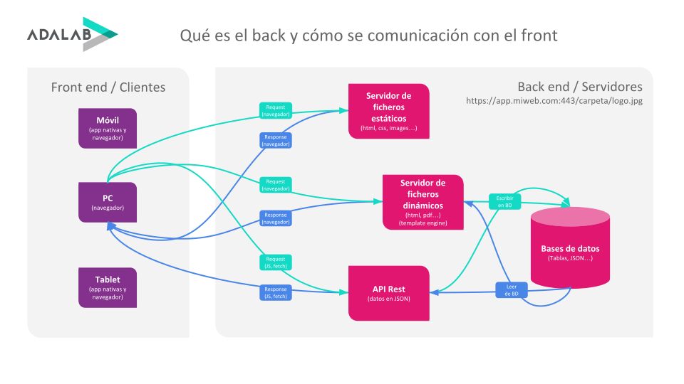

# Comunicación entre front y back

Ahora mismo eres experta en programación front. Ya que vas a aprender cómo funciona la parte de back end, lo primero que tenemos que hacer es aprender cómo se comunican ambos mundos.

Vamos a ver este [vídeo](https://www.youtube.com/watch?v=knnzF-d0V1I) para entender cómo se comunica el front y el back:



### ¿Qué significa API Rest?

**Queremos hacer una pequeña aclaración:** hasta ahora a la API la hemos llamado API. Así la llama todo el mundo. API siginifica literalmente **Application Protocol interface** o **Application Programming Interface**. En cristiano, un protocolo para comunicar dos ordenadores o dispositivos. Por ejemplo front con back.

En concreto la API de la que vamos a hablar durante todo el módulo se llama **API Rest** o **API Restful**. Durante el módulo explicaremos más acerca de este protocolo.

