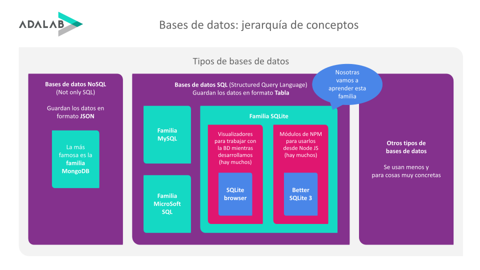

# Introducción a bases de datos

## ¿Qué es una base de datos?

Una base de datos es **el programa** donde vamos a almacenar **todos los datos de nuestra aplicación y de nuestros usuarios** como por ejemplo:

- Email, contraseña, nombre... de nuestras usuarias registrados.
- Tweets de Twitter.
- Comentarios de los vídeos de Youtube.
- Artículos de un blog.
- Eventos de Google Calendar.
- Configuración interna de nuestra web.
- En resumen, todos los datos que no tenemos a la hora de programar.

## ¿Dónde se ejecutan las bases de datos?

La base de datos de una aplicación **se está ejecutando en todo momento en nuestro servidor**, ya sea nuestro servidor local de desarrollo o el servidor de producción donde subiremos nuestro código.

Cuando reiniciamos nuestro ordenador, si volvemos a arrancar una aplicación de **Node JS se ejecuta como si fuera la primera vez**. Es decir no guarda nada de una ejecución a otra.

Pero cuando trabajamos con una base de datos, los cambios que hacemos sobre ella **se guardan en ficheros especiales**. Por ello si reiniciamos el ordenador y volvemos a abrir la base de datos, esta mantiene los datos que tenía la última vez que se ejecutó. Por ello, **las bases de datos nos permiten guardar datos de forma permanente.**

## ¿Cómo accedemos a una base de datos?

Desde nuestro código de Node JS vamos leer y escribir datos en nuestra base de datos **usando una determinada sintaxtis**. También podemos hacer lo mismo desde cualquier otro lenguaje de programación de back end usando la misma sintaxis o muy parecida.

Es decir que lo que vamos a aprender sobre bases de datos nos vale para cuando estamos programando en cualquier lenguaje de back end.

## ¿Qué vamos a aprender en Adalab?



El mundo de las bases de datos es inmenso y nosotras vamos a aprender solo una parte. Te recomendamos que cada vez que hablemos de un concepto nuevo, revises este diagrama para entender de qué estamos hablando.

## ¿Qué tipos de bases de datos hay?

Hay muchísimos tipos de bases de datos. Cada tipo está orientado a una cosa, por ejemplo:

- Hay bases de datos que guardan datos importantes como por ejemplo las de los bancos, que almacenan todos nuestros movimientos bancarios. Están pensadas para ser muy seguras y no perder información bajo ningún concepto.
- Hay otras que están pensadas para guardar información efímera. Al ser información efímera el tamaño de la base de datos es pequeño. Al ser pequeño, las búsquedas que se hacen sobre esa base de datos son muy rápidas. Un ejemplo son las bases de datos que guardan las notificaciones emergentes de WhatsApp que muestran en tu móvil. Cuando una amiga te envía un WhatsApp, se añade la notificación a una base de datos. Horas después tu enciences el móvil y WhatsApp comprueba que en su base de datos tienes notificaciones pendientes y te envía la notificación. Por último el servidor de WhatsApp borra la notificación de su base de datos para siempre jamás.

A nosotras nos interesa saber los tipos de bases de datos que hay **en función de cómo estructuran los datos**.

### Bases de datos de tipo JSON o NoSQL

Supongamos que queremos guardar la información de las alumnas de Adalab en un JSON. Podría tener esta pinta:

```json
[
  {
    "id": 1,
    "email": "maria@gmail.com",
    "password": "987widJYVxyh",
    "name": "María"
  },
  {
    "id": 2,
    "email": "lucia@hotmail.com",
    "password": "qwertyui",
    "name": "Lucía"
  },
  {
    "id": 3,
    "email": "sofia@yahoo.com",
    "password": "mnbvcdfgu",
    "name": "Sofía",
    "pc": {
       "number": 54,
       "brand": "Lenovo"
    }
  }
]
```

En esta base de datos vemos que las 3 alumnas tiene un `id`, un `email`, un `password` y un `name`. Pero solo Sofía tiene un campo más que es `pc` que es un objeto. El campo `pc` indica que Adalab ha prestado a Sofía el portátil número 54, de la marca Lenovo, para que lo use durante el curso. En las alumnas María y Lucía no hemos guardado información acerca de sus portátiles.

Sabemos que los objetos de JSON pueden tener la estructura que queramos, por ello podemos guardar los datos que queramos de una alumna. **Y cada alumna puede tener diferentes datos.**

### Principales características de las bases de datos de tipo JSON

- Los datos se guardan en **colecciones, es decir arrays de objetos**.
- **Cada colección puede ser diferente.** Por ejemplo unas usuarias pueden tener unos datos y otras otros.
- Estos objetos **pueden estar compuestos de otros datos**: números, strings, arrays, objetos...
- **No tienen una estructura fija** de los datos, por ello **somos libres** de guardar lo que queramos fácilmente.
- Al no tener una estructura fija a veces es más difícil hacer búsquedas de datos en ellas.
- Una base de datos puede estar compuesta de muchas colecciones, por ejemplo una para alumnas, otra para promociones, otra para profes, otra para las empresas de la bolsa de empleo...

A estas bases de datos se les llama **NoSQL** (not only SQL) y la más famosa de este tipo es [MongoDB](https://www.mongodb.com/es).

### Bases de datos de tipo tabla o SQL

Ahora supongamos que queremos guardar los datos de las alumnas de Adalab en una tabla. Podría tener esta pinta:

| id  | email              | password     | name  | pc    | pcNumber | pcBrand |
| --- | ------------------ | ------------ | ----- | ----- | -------- | ------- |
| 1   | maria@gmail.com    | 987widJYVxyh | María | false |          |         |
| 2   | lucia@hotmail.com  | qwertyui     | Lucía | false |          |         |
| 3   | sofia@yahoo.com    | mnbvcdfgu    | Sofía | true  | 54       | Lenovo  |

Como véis esto es muy parecido a guardar los datos en un documento de Excel.

### Principales características de las bases de datos de tipo tabla o SQL

- Los datos se guardan en **tablas, es decir filas y columnas**.
- **Todas las filas o registros de una tabla tienen que tener los mismos campos**, aunque algunos puedan estar vacíos.
- Si queremos añadir un dato más a una fila, tenemos que añadir una columna más, y por ello todas las filas tendrán ese campo, aunque esté vacío. Dicho de otra forma, **o todas las usuarias tienen una columna o no la tiene ninguna**.
- **La estructura de datos es fija.**
- Al ser una estructura fija **las búsquedas son más rápidas**, porque la base de datos sabe qué datos hay y cómo buscarlos.
- Al ser una estructura fija **se pueden configurar muchas cosas**. Por ejemplo esta tabla se podría configurar para que si la columna `pc` es `true`, las columnas `pcNumber` y `pcBrand` deben estar rellenas, si es `false` deben estar vacías.
- **Las columnas tienen un tipo de dato**, por ejemplo `id` y `pcNumber` son números, `pc` es un booleano y el resto son `strings`.
- **Una base de datos puede estar compuesta de muchas tablas**, por ejemplo una para alumnas, otra para promociones, otra para profes, otra para las empresas de la bolsa de empleo...

A estas bases de datos se les llama **SQL** (Structured Query Language).

En Adalab vamos a aprender a usas las bases de datos SQL porque:

- Son más fáciles de aprender.
- Son más antiguas (pero no están anticuadas ni mucho menos) y por ello se usan más.

## SQL vs NoSQL

Las bases de datos NoSQL no tienen una estructura fija, por ello nos dan mucha libertad para trabajar como queramos. Esto nos obliga a tener mucho cuidado para que dicha libertad no se convierta en libertinaje y que no perdamos el control sobre qué datos estamos guardando, cosa que si no se tiene cuidado puede pasar.

Las base de datos SQL sí tienen una estructura fija, por ello son más estrictas. Tenemos las manos más atadas a la hora de meter datos. Pero a cambio la base de datos sabe qué datos guarda y por ello se pueden configurar muchas cosas, automatizar tareas, hacer búsquedas más óptimas, prohibir que se guarden datos por error...

## ¿Qué base de datos usar en mi proyecto?

Cuando trabajéis en una empresa y tengáis que elegir una base de datos u otra tenéis que analizar qué tipos de datos vais a guardar, y en función de ello elegir.

##### ¿Te ha gustado?

Por favor rellena este [formulario](https://adalab.typeform.com/to/Rc0bft9x) para darnos feedback sobre la calidad de esta mini lección.