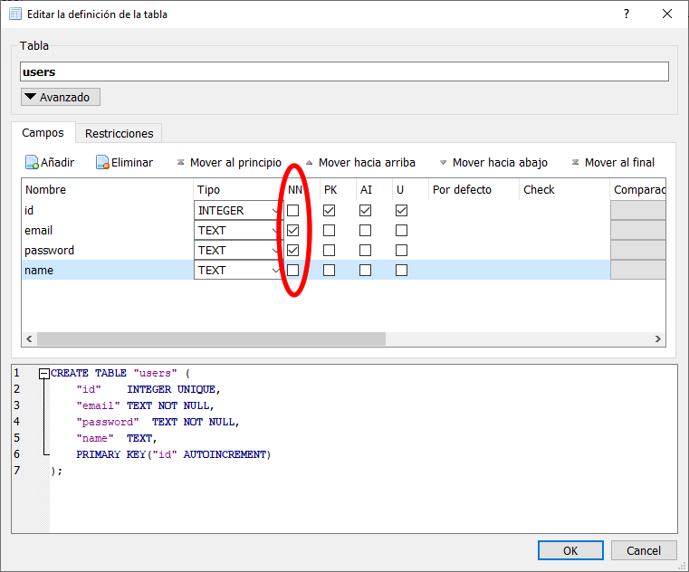
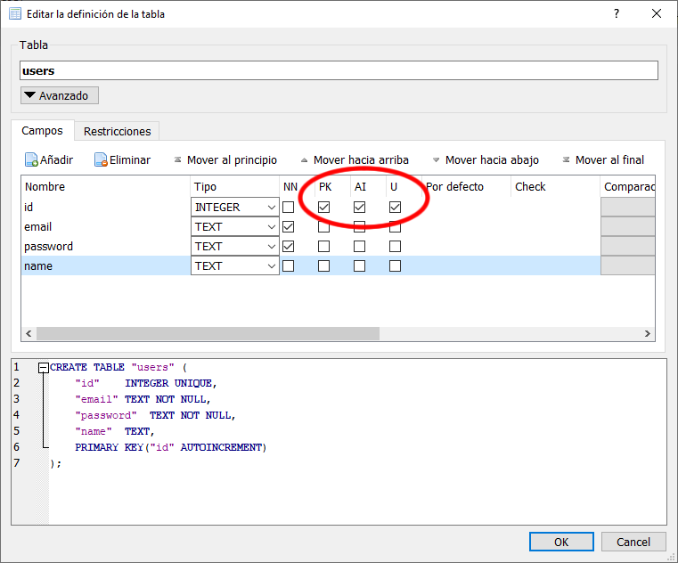

# Tipos de columnas de una tabla

Como hemos comentado en las primeras lecciones de SQL, ésta es una **base de datos con una estructura muy estricta**. Esto nos permite controlar muy bien qué datos se están guardando en nuestras tablas.

Cuando estamos creando las tablas de nuestra base de datos podemos elegir **qué tipo de dato** se puede guardar en cada columna.

## Tipos de datos en SQLite

SQLite tiene los siguientes tipos de datos:

- **INTEGER:** para números enteros, positivos y negativos.
- **TEXT:** para textos de cualquier tamaño.
- **BLOB:** para guardar información de cualquier tipo, se suele usar para guardar ficheros en modo binario.
- **REAL:** para guardar números con muchos decimales sin exactitud. Esto de la exactitud es una movida muy chunga de cómo se guardan los datos en el disco duro de un ordenador.
- **NUMERIC:** para guardar números con muchos decimales con exactitud, booleanos, fechas...

**SQLite no es tan estricta como otras bases de datos:**

- Si intentamos guardar el `string` `'1'` en un campo `integer` lo intenta convertir a número y va a guardar como el entero 1. Es decir, lo va a guardar con el tipo de dato que hemos configurado.
- Si intentamos guardar el `string` `'Hola'` en un campo `integer` no lo puede convertir a número y va a guardar el `string` `'Hola'`. Es decir, no lo guarda con el tipo de dato que hemos configurado. Es nuestra responsabilidad no hacer esto.
- Si intentamos guardar el `string` `'Hola'` en el campo `id` que es de tipo `integer` nos lanzará un error. Esto es porque necesita que todos los `id` sean enteros.

## Tipos de datos en MySQL

Por poner un ejemplo de otra familia vamos a ver los tipos de datos que se pueden configurar en MySQL:

- Tipos de datos de texto:
   - **CHAR:** para guardar caracteres sueltos: `a`, `z`, `A`, `Z`, `1`, `@`, `€`...
   - **VARCHAR:** para guardar textos con tamaño máximo que podemos configurar nosotras.
   - **TINYTEXT:** para guardar textos de un máximo de 255 caracteres.
   - **TEXT:** para guardar textos de un máximo de 65535 caracteres.
   - **MEDIUMTEXT:** para guardar textos de un máximo de 16777215 caracteres.
   - **LONGTEXT:** para guardar textos de un máximo de 4294967295 caracteres.
   - **SET:** para guardar textos de un determinado conjunto. Por ejemplo podemos indicar que solo se puede guardar los textos: user, admin y customer.
- Tipos de datos numéricos:
   - **TINYINT:** para guardar enteros entre 0 y 255.
   - **BOOL:** para guardar enteros entre 0 y 1. Muy útil para guardar booleanos.
   - **SMALLINT:** para guardar enteros entre 0 y 65535.
   - **MEDIUMINT:** para guardar enteros entre 0 y 16777215.
   - **INTEGER:** para guardar enteros entre 0 y 4294967295.
   - **BIGINT:** para guardar enteros entre 0 y 9223372036854775807.
   - **FLOAT:** para guardar números con decimales.
- Tipos de datos de fechas:
   - **DATE:** para guardar fechas en formato YYYY-MM-DD.
   - **DATETIME:** para guardar fechas en formato YYYY-MM-DD hh:mm:ss.
   - **TIMESTAMP:** para guardar fechas en milisegundos. Concretamente los milisegundos transcurridos desde el 1 de enero de 1970. Esto es otra movida... pero nos permite saber una fecha independientemente de los husos horarios.

Y estos son solo algunos, hay muchos más.

MySQL es muy estricta, y si intentamos guardar un dato en una columna que no corresponde con el tipo de dato nos lanza un error.

## Beneficios de configurar bien los tipos de datos

### Tamaño de las bases de datos

Como habéis visto en MySQL cada dato tiene un tamaño máximo. **Eso significa que la base de datos reserva espacio en el disco duro del ordenador para cada dato.**

Si queremos guardar la edad de nuestras usuarias en base de datos deberemos utilizar el tipo de dato **TINYINT**, porque queremos guardar un número entero entre 0 y 255. Si en vez de configurar nuestra columna con un **TINYINT** la configuramos con un **BIGINT (enteros entre 0 y 9223372036854775807)** la base de datos estará reservando mucho espacio en el disco duro de nuestro ordenador para edades que nunca serán tan grandes.

Pensad que las aplicaciones que vosotras haréis cuando trabajéis en una empresa pueden tener varios miles de usuarios, lo que equivale a varios GigaBytes de espacio. La base de datos de GitHub puede tener muchos TeraBytes. Como no optimicemos bien el espacio lo estaremos desperdiciando. **Por cierto los discos duros cuestan dinero.** Si optimizas bien la base de datos le estás ahorrando a tu empresa varios cientos de euros al mes.

También pensad cuánto tardaría tu ordenador en abrir con SQLite una base de datos que pese 100 Gigas.

### Tiempo de búsquedas

Cada vez que lees o escribes en una base de datos, ésta tiene que buscar entre todos los registros cuál es el registro que quieres leer o modificar.

Piensa que al abrir un email de Gmail los servidores de Google estarán haciendo entre 20 y 50 accesos a sus bases de datos. Si no optimizamos las bases de datos las aplicaciones tienen un cuello de botella en el acceso a sus datos.

## Tipos de datos nulos

SQLite tiene una opción para indicar que una columna debe tener siempre datos:

Si activamos esta opción en las columnas email y password, cuando añadimos un registro o lo modificamos y no indicamos el valor del email o el del password, SQLite nos lanza un error y no ejecutará la query.

Podemos pensar que es importante no permitir que ninguna usuaria se registre sin indicar su email o contraseña.

## Columna especial id

En todos los ejemplos que hemos visto hasta ahora siempre hemos configurado la primera columna como `id`.

Esta columna funciona como un identificador único de cada registro. Es el DNI del registro. De esta forma nos aseguramos que si cualquier otro campo cambia, este nunca va a cambiar.

No es obligatorio tener una columa `id` en una tabla, pero es muy muy recomendable. Así que siempre que creamos una nueva tabla le vamos a poner como primera columna el `id`.

Tampoco es obligatorio que esta columan se llame `id`, puede llamarse `userId`, `user_id` o como queramos.

También te abrás fijado que en la columna `id` activamos siempre las opciones `PK`, `AI` y `U`. **Tú debes activar estas tres opciones en todas las columnas `id` de todas tus tablas.**

### Primary key (PK)

Activando en la columna `id` la **primary key** le estamos indicando a la base de datos que esta es nuestra columna principal, la que contiene el identificador único.

Gracias a esto podemos relacionar unas tablas con otras y automatizar tareas.

Supongamos que tenemos dos tablas en una base de datos de una tienda online:

- `users` que tiene la `PK` activada en la columna `id`.
- `orders` que guarda los pedidos de las usuarias y que tiene una columna llamada `userId` en la que indicamos que un pedido pertenece a una usuaria.

Gracias a primary key de `users` y a un poco de configuración podríamos automatizar tareas, como por ejemplo que si borramos una usuaria de la tabla `users` automáticamente se borren todos los pedidos de esa usuaria en la tabla `orders`. De esta forma no habría nunca pedidos "huérfanos".

### Autoincrement (AI)

Te habrás fijado que al crear un nuevo registro nunca indicamos el `id` que debe tener. Eso es porque lo añade SQLite automáticamente. Lo hace por nosotras.

Y cómo sabe qué `id` debe asignar al nuevo registro, pues porque le hemos dicho que es auto incremental. La primera vez que añadimos un registro ya sea desde SQLite browser o desde Node JS le asigna el `id`. La segunda vez el 2...

Así cada registro tiene un `id` único que no se repite.

### Unique (U)

Como hemos dicho el `id` debe ser único. Pues si configuramos el `id` como `unique` nunca podrá haber en una tabla dos registros con el mismo `id`.

Si intentamos modificar el `id` de un registro y ya existe otro con el mismo `id` SQLite nos lanzará un error y no ejecutará la query.

Esto también es útil para otras columnas como el email. Si consideramos que no puede haber dos usuarias en nuestra web con el mismo email podemos marcar la opción `U` en la columna email. Si la misma usuaria intenta registrarse dos veces con el mismo email SQLite lanzará un error y no permitirá.

## Otras opciones de SQLite

### Por defecto

Podemos configurar la opción **Por defecto** en una columna. Si al añadir un registro a la tabla no indicamos ningún valor para esa columna, SQLite lo añadirá por nosotras poniéndole el valor por defecto.

### Check

Podemos indicar la opción **Check** en una columna indicando algún tipo de restricción que debe cumplir.

Por ejemplo, supongamos que creamos una columna llamada `phone` y en la opción **check** ponemos `length(phone) >= 9`. Si añadimos un nuevo registro y en el valor de la columna `phone` ponemos un número de teléfono de menos de 9 dígitos, SQLite lanzará un error y no ejecutará la consulta.