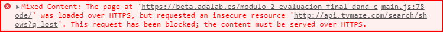

# Errores comunes en programación

En esta sección recopilamos algunos errores comunes que nos encontramos en nuestro día a día en programación:

## Mixed Content: HTTP vs HTTPS

##### Problema

Un día cualquiera estás programando tu web y estás pidiendo datos a un API con un `fetch` o estás importando ficheros. Lo normal es que escribas el siguiente código:

```js
fetch('http://dominio.com/api/users').then(...);
```

```html
<link rel="stylesheet" href="http://dominio.com/css/main.css" />
```

```html
<script src="http://dominio.com/js/main.js" />
```

```css
background-image: url('http://dominio.com/images/logo.jpg')
```

Pruebas tu código en un servidor y de repente fallan cosas, abres la consola de DevTools y **katakroker**, ves el siguiente error:



##### Explicación

El problema es que estás probando tu página desde una dirección que empieza por `https://...`, es decir, es una página con protocolo **HTTP seguro**. Desde una página **segura** estás utilizando recursos **inseguros** que empiezan por `http://...`.

> **Nota**: HTTP seguro significa que toda la información que se envía y recibe desde tu web está **cifrada**. Es decir, que si alguien se ha colado en tu wifi no puede desencriptar la información que envías y recibes. [Más info aquí](./assets/images/error-mixed-content-2.jpg).

Los navegadores no permiten esto debido a que si yo como usuario entro en una página segura, espero que todos los datos y ficheros de esa página se sirvan desde una dirección segura.

##### Solución 1: pon todo con https://...

Revisa todos los `fetch` y ficheros que usas en tu web y cambia todos los `http://...` por `https://...`.

##### Solución 2: quita todos los http y https

Sustituye tus:

```js
fetch('http://dominio.com/api/users').then(...);
```

por

```js
fetch('//dominio.com/api/users').then(...);
```

De esta forma si estás entrando en una página segura el navegador añadirá a tu `fetch` el `https:` delante y la petición se hará a `https://dominio.com/api/users`. Si estás entrando en una página insegura el navegador añadirá a tu `fetch` el `http:` delante y la petición se hará a `http://dominio.com/api/users`.

De esta forma te curas en salud y tu página funcionará siempre. **Esta es la mejor solución.**