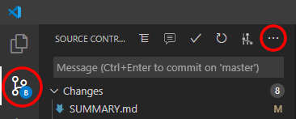

# Git stash

Git stash es una herramienta muy útil pero un poco avanzada. No la explicamos durante el curso, pero os la explicamos aquí para que cuando estéis muy aburridas podáis aprender algo nuevo :)

## ¿Qué es?

Git nos permite guardar el código modificado y no commiteado a una especie de cajón temporal, al que llamaremos **stash** y recuperarlo más tarde.

## ¿Para qué sirve?

* Imagina que estás trabajando en la rama A y has hecho cambios en el código. Te quieres cambiar a la rama B pero todavía no quieres commitear los cambios actuales a la rama A.
* O estás trabajando en la rama A y quieres subir los cambios actuales a la rama B. Haces un checkout y Git te dice que no te puedes cambiar de rama porque hay cambios en tu código y no quiere sobre escribirlos ni borrarlos.
* O tienes un montón de cambios sin commitear y haces `git pull` y Git te da error porque si te bajas los commits de tus compañeras se machacan tus cambios.

**Solución:** guardamos el código en un stash, los cambios desaparecen de nuestra rama, es decir, se queda limpia, y ahora sí te puedes cambiar a la rama que quieras. Más tarde puedes recuperar tu código desde ese stash.

> **Nota:** puedes tener tantos stash como quieras.

## ¿Cómo funciona?

Una vez que tenemos cambios en nuestra rama, por ejemplo máster, que queramos guardar en un stash hacemos:

```bash
git stash push -m "Description of the code I am saving"
```

Ahora mi rama está limpia y me puedo cambiar a la rama que quiera.

**Más tarde en la rama que sea**, quiero recuperar el código. Para ver el listado de stash que tengo en este repo, hago:

```bash
git stash list
```

Y me aparece el listado de todos los stash, como por ejemplo:

```bash
stash@{0}: On master: Description of the code I am saving
stash@{1}: On header: Work in progress: header
```

Para recuperar el stash 0, es decir, para coger el código y ponerlo en nuestra rama, haremos:

```bash
git stash pop stash@{0}
```

Y en nuestra rama aparecerán los cambios como si los acabaramos de escribir ahora mismo, es decir, sin commitear.

## Borrar los stash

En el momento que queramos borrar los stash que hemos ido creando, haremos...

```bash
git stash list
```

... para saber el índice del stash que queremos borrar. Aquí vamos a borrar el stash 0.

```bash
git stash drop stash@{0}
```

## Importante

Todo estos movimientos de código para allá y para acá se hacen sin hacer commit, ni push, por lo que esto solo sucede en nuestro local. Nunca sube a remoto. Para que suba a remoto tenemos que crear un commit y hacer un push como siempre.

## Stash en VS Code

Aquí te hemos enseñado a usar Stash desde la terminal pero también puedes hacerlo desde VS Code. Para ello:

- Abre tu VS Code
- Pulsa en el icono de Git (arriba a la izquiera)
- Pulsa en los tres puntitos
- Trastea e investiga!!!

